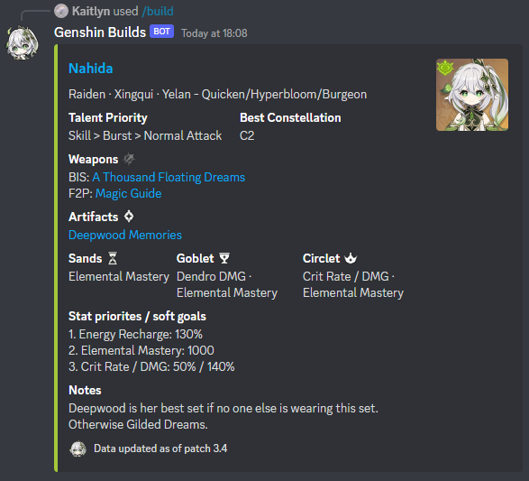
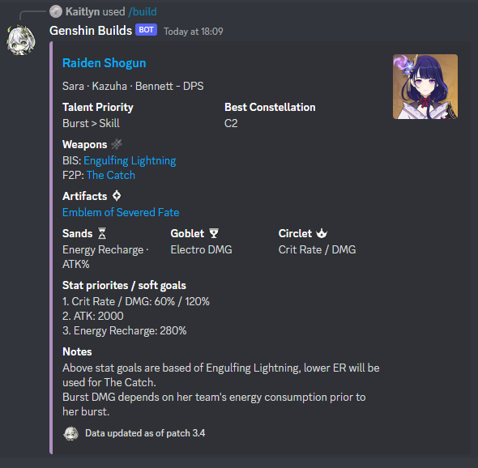

# Genshin Builds Bot

A clean Discord bot that provides you with recommended builds for your favourite Genshin Impact characters.

## Installation & Usage
-   Install Node.js and npm from https://nodejs.org/en/download/
-   Clone the repository with `git clone https://github.com/jeremyle56/genshin-builds-bot`
-   Go to `.env` and fill in
    -   `DISCORD_TOKEN` with the token of the bot
    -   `APP_ID` with the ID of the bot application
-   Install dependencies with `npm install`
-   Register slash commands with `node deploy-commands.js`
-   Start the bot with `node index.js`
- In the discord sever with the bot, type `/build <character>` where `<character>` is the name
of the charcter whose build you would like to see.

## Features
Provides: 
- Example team and role
- Image and element of character
- Talent Priority
- "Best" Constellation
- Best-in-slot weapon and free to play alternative
- "Best" artifact set(s)
- Desired main artifact stats
- Stat priorites and soft goals
- Notes about gameplay and build info

## Example

## Status
MVP. Has one build for all characters, data updated as of patch 3.4.

### TODO
- [X] Create build for all characters
- [ ] Create command for all characters (e.g. `/nahida`)
- [ ] Implement and create multiple builds for each character (e.g. Raiden DPS and Hyperbloom)
- [ ] Host bot on a server

## Questions/Suggestions/Bug Reports
If you have a question, need troubleshooting help, or want to brainstorm a new feature, please contact me at jeremyle56@gmail.com or Kaitlyn#1774 on discord (preferred). 

If you'd like to suggest a feature or report a reproducible bug, please open an [Issue](https://github.com/jeremyle56/genshin-builds-bot/issues) on this repository.

## Credits
- [Keqing Mains](https://keqingmains.com/) - Character builds, teams and constellations info
- [Genshin Builds](https://genshin-builds.com/) - Character builds and teams
- [Genshin Wiki](https://genshin-impact.fandom.com/wiki/Genshin_Impact_Wiki) - General info, icons and hyperlinks
- [Genshin Impact Helper Team's Character Builds](https://docs.google.com/spreadsheets/d/e/2PACX-1vRq-sQxkvdbvaJtQAGG6iVz2q2UN9FCKZ8Mkyis87QHFptcOU3ViLh0_PJyMxFSgwJZrd10kbYpQFl1/pubhtml#) - Character weapon rankings, artifact sets, talent priorites and notes
- [Genshin Notes](https://genshin.tmdict.com/) - Character stat goals and priorites
- [Genshin Optimizer](https://github.com/frzyc/genshin-optimizer) - Character avatar icons
- [Xlice](https://www.youtube.com/@Xlice) - Character build info
- [Profile picture](https://twitter.com/Daily_Nahida/status/1585493163728404481) and [Footer Icon](https://getstickerpack.com/stickers/nahida-kusanali) - for Nahida chibis
- All above data was compiled into [Genshin Builds Data](https://docs.google.com/spreadsheets/d/1g7w9QjptDe_OLStWhQYoTANET4tFIebFTAbQmPAVsMA/edit#gid=0) which was then converted to [builds.json](./builds.json)
